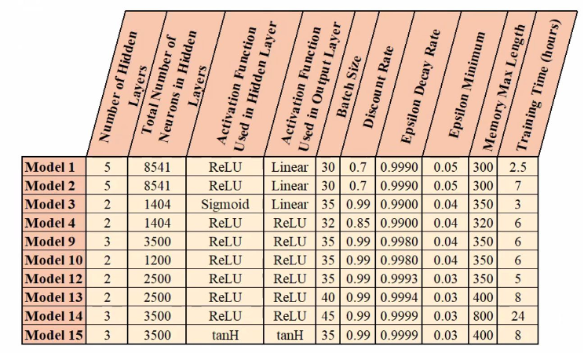

# StockAreaRearrangement

## Project Overview

This project is the preliminary preparation for our research on Deep Q-Learning (DQN) algorithms. Our objective is to optimize coil (bobbin) stacking in Borçelik's warehouse using a Deep Q-Learning approach. We aim to develop a system that can rearrange coils with minimal movements and compare it with a Mixed-Integer Programming (MIP) model.

## Repository Structure

This repository contains the following files:

- `singleModelTest.py`: Script to test a single DQN model.
- `Bobbin.py`: Contains the environment and class definitions for bobbin stacking.
- `DQNModelComparison.py`: Script to compare different DQN models.
- `Env_wnr.py`: Environment setup for the warehouse.
- `illegal_actions.txt`: List of illegal actions for the DQN agent.
- `illegalActions.py`: Script to manage and filter illegal actions.
- `manuelSolveDQNpy`: Script for manually solving DQN.
- `trainDQN.py`: Script to train the DQN model.

## Installation

To run the project, you need to have Python installed along with the following libraries:

```bash
pip install numpy pandas gym matplotlib torch
```

## Usage

1. **Training the DQN Model**:
   Run the `trainDQN.py` script to start training the DQN model.

   ```bash
   python trainDQN.py
   ```

2. **Testing the Model**:
   Use the `singleModelTest.py` script to test the trained model.

   ```bash
   python singleModelTest.py
   ```

3. **Comparing Models**:
   The `DQNModelComparison.py` script compares different DQN models to evaluate their performance.

   ```bash
   python DQNModelComparison.py
   ```

## Model Information

We have 16 models with detailed information provided. You can find the models [here](https://drive.google.com/drive/folders/18kGgmX7K4KekBOEH6yYIde4umpgRj7Hy).

Here is a summary of the training presets for these models:



## Tables

We provide tables to summarize the results and comparison of the models:

**Individual Model Analysis:**

| Model | Episodes Completed as Best | Total Score When Best | Average Score When Best |
|-------|-----------------------------|-----------------------|-------------------------|
| Model 1 | 76 | 8728 | 114.84 |
| Model 2 | 158 | 19412 | 122.86 |
| Model 3 | 133 | 9200 | 69.17 |
| Model 4 | 64 | 3850 | 60.16 |
| Model 9 | 23 | 1457 | 63.35 |
| Model 10 | 38 | 1536 | 40.42 |
| Model 12 | 129 | 10312 | 79.94 |
| Model 13 | 60 | 4079 | 67.99 |
| Model 14 | 188 | 12846 | 68.33 |
| Model 15 | 61 | 3332 | 54.62 |

**Performance Comparison When Models Used Together:**

| Model | Time Taken for 1000 Episodes | Average Reward for 1000 Episodes | Negative Reward Finish Count for 1000 Episodes | Negative Reward Finish Percentage for 1000 Episodes |
|-------|------------------------------|----------------------------------|-----------------------------------------------|---------------------------------------------------|
| Model 1 | 91.19 | 42.36 | 235 | 23.50% |
| Model 2 | 89.17 | 28.18 | 215 | 21.50% |
| Model 3 | 92.12 | 41.74 | 143 | 14.30% |
| Model 4 | 85.35 | 20.61 | 197 | 19.70% |
| Model 9 | 87.83 | 18.02 | 331 | 33.10% |
| Model 10 | 87.96 | 21.22 | 337 | 33.70% |
| Model 12 | 88.08 | 37.47 | 202 | 20.20% |
| Model 13 | 85.33 | 40.54 | 268 | 26.80% |
| Model 14 | 100.31 | 52.24 | 133 | 13.30% |
| Model 15 | 94.65 | 44.77 | 115 | 11.50% |

## Animation Videos

You can view the performance of the trained DQN models through the following animation videos:

- [DQN Animation](DQN_Animation.mp4)

## Contributor

- [Egecan Aktan](egecan.aktan@ozu.edu.tr)

## License

This project is licensed under the MIT License.

## Acknowledgments

We would like to thank Borçelik for their support and the opportunity to apply our research in a practical setting.
